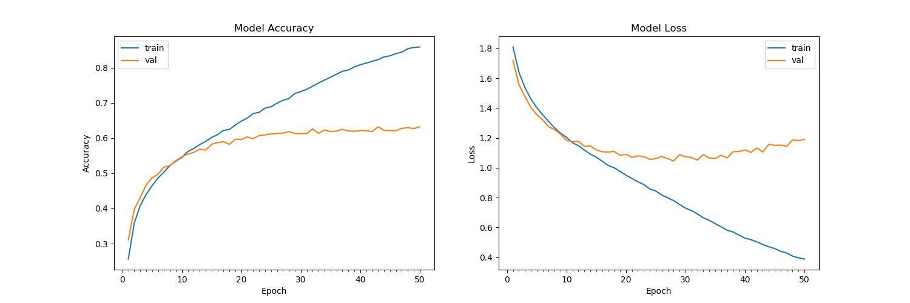

# Real-Time Emotion Detection

[](https://opensource.org/licenses/MIT)

This project is a real-time emotion detection application that utilizes a Convolutional Neural Network (CNN) to classify human emotions from a live webcam feed. The model is trained on the renowned FER2013 dataset.

## Table of Contents

- [Features](#features)
- [Demo](#demo)
- [Project Structure](#project-structure)
- [Installation](#installation)
- [Usage](#usage)
  - [1. Prepare the Dataset](#1-prepare-the-dataset)
  - [2. Train the Model](#2-train-the-model)
  - [3. Run Real-Time Prediction](#3-run-real-time-prediction)
- [Model Architecture](#model-architecture)
- [Results](#results)
- [Contributing](#contributing)
- [License](#license)
- [Credits](#credits)

## Features

-   Real-time emotion detection from a webcam feed.
-   Seven emotion categories: Angry, Disgusted, Fearful, Happy, Neutral, Sad, and Surprised.
-   Simple and modular code structure.
-   Easy to train and test the model.

## Demo

*(This is where you could add a GIF showcasing the real-time prediction.)*


## Project Structure

```
Emotion-detection-master/
├───LICENSE
├───README.md
├───requirements.txt
├───imgs/
│   └───accuracy.png
└───src/
    ├───dataset_prepare.py
    ├───haarcascade_frontalface_default.xml
    ├───predict.py
    └───train.py
```

## Installation

1.  **Clone the repository:**
    ```bash
    git clone https://github.com/nirajsingh-codes/Emotion-detection-master.git
    cd Emotion-detection-master
    ```

2.  **Install the dependencies:**
    ```bash
    pip install -r requirements.txt
    ```

3.  **Download the dataset:**
    Download the FER2013 dataset from [Kaggle](https://www.kaggle.com/c/challenges-in-representation-learning-facial-expression-recognition-challenge/data). Place the `fer2013.csv` file in the root directory of the project.

## Usage

### 1. Prepare the Dataset

This script processes the `fer2013.csv` file and organizes the images into `train` and `test` directories, sorted by emotion.

```bash
python src/dataset_prepare.py
```

By default, it looks for `fer2013.csv` in the parent directory (`../fer2013.csv`) and saves the processed data to `../data`. You can change these paths using command-line arguments:

```bash
python src/dataset_prepare.py --csv /path/to/your/fer2013.csv --output /path/to/your/data
```

### 2. Train the Model

This script trains the CNN model on the prepared dataset and saves the trained model as `model.h5`. It also saves a plot of the training accuracy and loss to `imgs/accuracy.png`.

```bash
python src/train.py
```

You can customize the training process with these arguments:

-   `--data_dir`: Path to the data directory (default: `../data`).
-   `--output_dir`: Path to the output directory (default: `..`).
-   `--lr`: Learning rate (default: `0.0001`).
-   `--epochs`: Number of epochs (default: `50`).
-   `--batch_size`: Batch size (default: `64`).

Example:
```bash
python src/train.py --epochs 100 --lr 0.001
```

### 3. Run Real-Time Prediction

This script uses the trained model (`model.h5`) to predict emotions from a webcam feed in real-time.

```bash
python src/predict.py
```

Press `q` to quit the video feed.

You can specify the path to the model and the cascade file:

-   `--model`: Path to the model file (default: `../model.h5`).
-   `--cascade`: Path to the cascade file (default: `haarcascade_frontalface_default.xml`).

## Model Architecture

The model is a Convolutional Neural Network (CNN) with the following architecture:

-   Conv2D layer (32 filters, 3x3 kernel, ReLU)
-   Conv2D layer (64 filters, 3x3 kernel, ReLU)
-   MaxPooling2D layer (2x2 pool size)
-   Dropout (0.25)
-   Conv2D layer (128 filters, 3x3 kernel, ReLU)
-   MaxPooling2D layer (2x2 pool size)
-   Conv2D layer (128 filters, 3x3 kernel, ReLU)
-   MaxPooling2D layer (2x2 pool size)
-   Dropout (0.25)
-   Flatten layer
-   Dense layer (1024 units, ReLU)
-   Dropout (0.5)
-   Dense layer (7 units, softmax)

## Results

The model achieves an accuracy of approximately 63% on the test set. The accuracy and loss curves during training are shown below:



## Contributing

Contributions are welcome! Please feel free to submit a pull request.

## License

This project is licensed under the MIT License. See the `LICENSE` file for details.

## Credits

This project was created and is maintained by **Niraj Singh** ([@nirajsingh-codes](https://github.com/nirajsingh-codes)).


